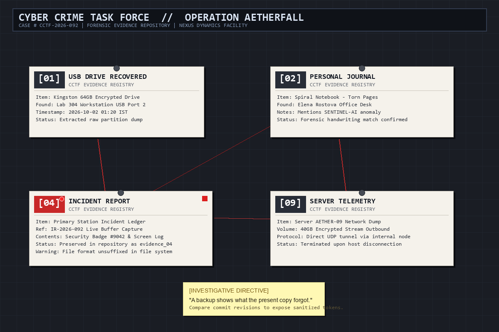

# OPERATION AETHERFALL

**Case File:** CCTF-2026-092  
**Facility:** Nexus Dynamics — Building B, Room 304  
**Classification:** RESTRICTED // CYBER CRIME TASK FORCE INTERNAL DOSSIER  
**Incident Date:** October 1–2, 2026  

---

## 1. SITUATION REPORT

On the early morning of October 2, 2026, Dr. Elena Rostova—Lead Security Specialist at Nexus Dynamics—vanished without authorization from her primary workstation in Building B, Room 304.

Her terminal was discovered actively running an automated background daemon connected to an external synchronization node titled **Project Aether Archive**. An internal system lockdown countdown was initiated across the facility subnet.

Investigators with the Cyber Crime Task Force have secured Dr. Rostova's active directory partition, physical evidence locker, and network telemetry dump.

Your mandate is to review the recovered artifacts, reconstruct the sequence of events, identify the perpetrator, and stop the scheduled server wipe before all records are purged.

---

## 2. FORENSIC EVIDENCE BOARD

The Task Force has compiled recovered physical and digital items onto the active case board below:



> *"A backup shows what the present copy forgot."*

---

## 3. INVESTIGATION ARTIFACTS

Review the recovered records indexed in this repository:

| Artifact | Type | Description |
| :--- | :--- | :--- |
| `evidence_board.png` | Image | Case board indexing physical and digital items recovered from Scene 304. |
| `evidence_04` | Data Buffer | Raw buffer dump recovered from the active workstation. |
| `main.py` | Python Script | Workstation telemetry daemon left running at the scene. |
| `phone_log.txt` | Text Document | Transcript of intercepted VoIP transmission on Gate B relay. |
| `cam04_frame.png` | CCTV Capture | Security still frame recorded at Gate B perimeter. |
| `stage2_vault.zip` | Archive | Encrypted archive containing acoustic signal telemetry. |
| `lab_photo.png` | Image | Forensic photograph of Room 304 interior and whiteboard schematics. |
| `floor_blueprint.png` | Schematic | Architectural blueprint of Building B Level 3. |
| `system_diagnostics.log`| Text Log | Subsystem audit log and sensor telemetry. |
| `issues/` | Issue Archive | Synced audit logs and sensor reports (also viewable under GitHub Issues). |

---

## 4. INVESTIGATIVE CONSOLE

Investigators can authenticate passcodes, decrypt archives, and monitor the server wipe countdown through either interface:

### Terminal Console (Command Line)
```bash
python terminal.py
```

### Web Forensic Portal (Browser)
Open [`index.html`](index.html) in your browser (or host via GitHub Pages) to access the interactive investigation interface with audio playback, live countdown, and system disarm console.

---
*CYBER CRIME TASK FORCE — SPECIAL INVESTIGATION DIVISION*
